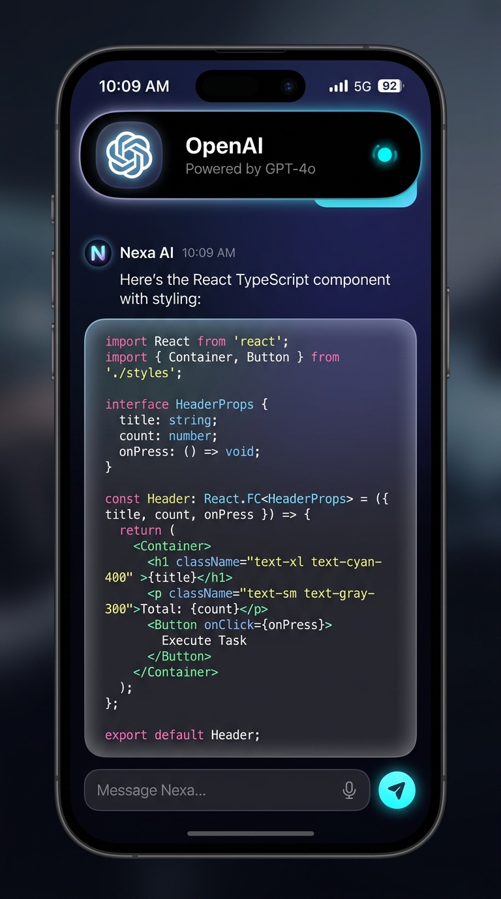
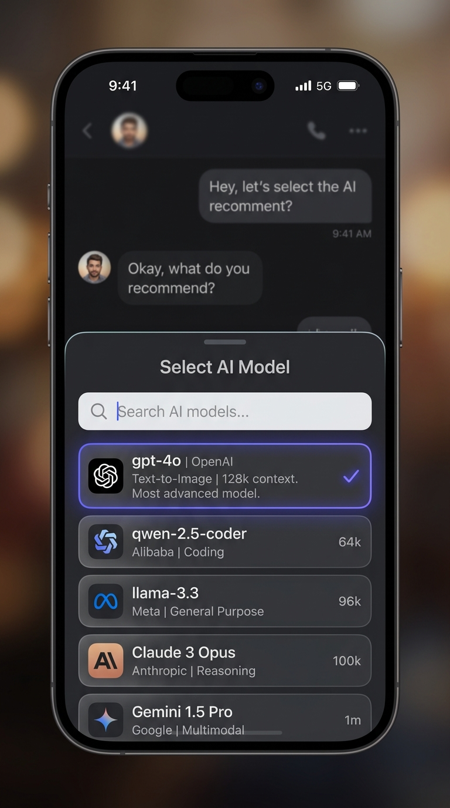
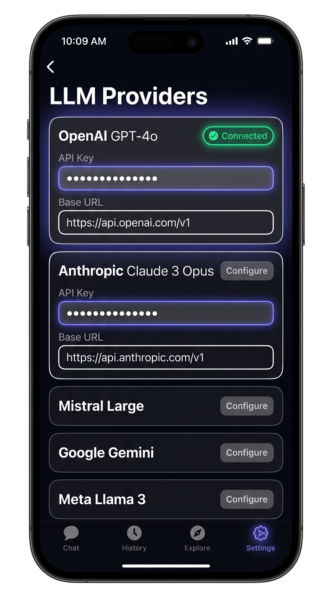

<p align="center">
  <br/>
  
</p>

<h1 align="center">Omnia</h1>

<p align="center">
  <b>One app. Every model. Pro in every detail.</b>
</p>

<p align="center">
  
  
  
</p>

<br/>

<p align="center">
  &nbsp;
  &nbsp;
  
</p>

<br/>

<h2 align="center">Design that gets out of the way.</h2>

Most mobile AI clients are web wrappers. Omnia is built fundamentally different. Engineered with rigorous mobile architecture, it guarantees that you never lose a prompt, your chats render at a flawless 60 FPS, and the application gracefully falls back to local processing when the cloud goes dark.

<br/>

## Pro Features. No Compromises.

### Flawless Real-Time Streaming
Tokens render immediately, completely optimized for mobile hardware. No React RAM leaks, no battery drain.

### Intelligence, Locally.
Natively supports commercial giants like OpenAI alongside your local, self-hosted models. Swap from cloud to local seamlessly when you go off-grid.

### Dynamic Context Switching
Tap the floating header to open the modal and switch models mid-conversation. No dropped context, no waiting.

### Absolute Persistence
Your data belongs to you. Every character is synchronously written to a local SQLite database. Swipe to pin your best ideas. Swipe to delete.

### Developer First
Native rendering for complex Markdown, tables, and nested formatting. Code blocks feature full syntax highlighting and a 1-click copy button.

### Haptic Intelligence
Feel your AI typing. Deep integration with the device haptic engine provides tactile feedback on stream completions and system events.

<br/>

## Built for Reality.

- **Idempotent Network Layer:** Unique request tracing prevents duplicate API billing even if your connection blinks.
- **Circuit Breakers:** If the cloud rate-limits you, Omnia intercepts the error and routes the prompt to your fallback local models.
- **Omnia Design System (ODS):** Encapsulated components driven by Storybook ensure every interface looks stunning before it ever hits the main application.

<br/>

## Start Developing

Omnia uses `pnpm` and Turborepo. 

```bash
git clone https://github.com/marceloserra/app-omnia.git
cd app-omnia
pnpm install

pnpm --filter mobile dev
```

---

<br/>

<p align="center">
  <i>Inspired by llama.cpp & LM Studio.<br/>Engineered heavily with Claude 3.5, Gemini 1.5 Pro, GPT-4o, and Qwen 32B.</i><br/><br/>
  <b>The bridge between your self-hosted lab, and your pocket.</b>
</p>
