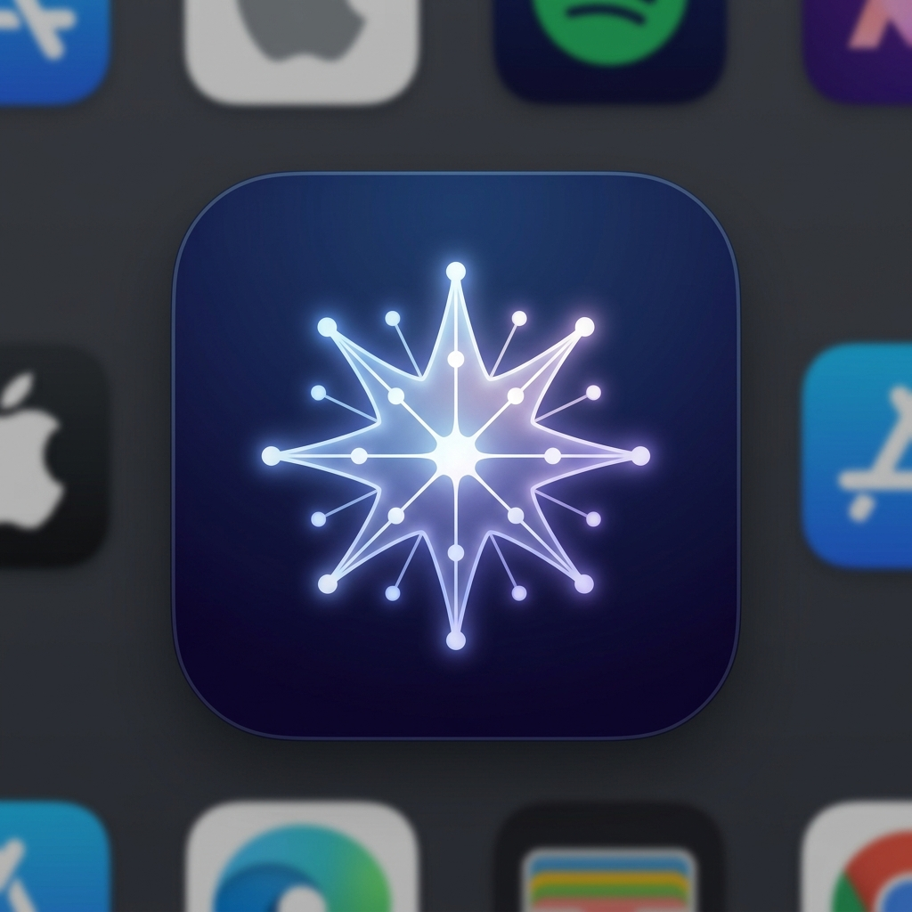

<h1 align="center">Omnia AI</h1>

<p align="center">
  
</p>

<p align="center">
  <strong>A fast, offline-capable native client for your Self-Hosted and Cloud AI models.</strong>
</p>

<p align="center">
  
  
  
  
  
  
</p>

<p align="center">
  <a href="#the-motivation">The Motivation</a> •
  <a href="#comprehensive-feature-set">Features</a> •
  <a href="#omnia-design-system-ods">Design System</a> •
  <a href="#built-for-mobile-reality">Architecture</a> •
  <a href="#quickstart">Quickstart</a>
</p>
<br>

<p align="center">
  <!-- TODO: Replace with actual .gif demo from Simulator -->
  
</p>
<br>

## The Motivation

In my journey of building and experimenting with self-hosted AI projects, I desperately needed a native mobile app that was simple, beautiful, and effortless to connect to my Local Self-Hosted AI stack ([ai-self-hosted-lab](https://github.com/marceloserra/ai-self-hosted-lab)). 

While I absolutely loved incredible projects like Open WebUI and llama.cpp UI, I always felt the friction of browser-based interfaces on my phone. I wanted something that felt *native*—something that tapped into the iPhone's haptic engine, handled network drops gracefully, and lived on my home screen. So, I decided to build it. Omnia is the bridge between your powerful local lab and your pocket.

---

## Comprehensive Feature Set

We didn't just build a chat wrapper; we built a fully-featured, production-ready mobile application. 

| Status | Feature | Description |
| :---: | --- | --- |
| [x] | **Real-Time Streaming** | Tokens render smoothly at 60 FPS, optimized for mobile hardware without causing React RAM leaks. |
| [x] | **Universal Provider Support**| Natively supports commercial giants (OpenAI) AND your Local/Custom Endpoints (OpenAI Compatible). |
| [x] | **Live Model Switching** | Tap the floating header to open a modal and switch models on the fly without dropping context. |
| [x] | **Developer-First Markdown** | Native rendering for complex Markdown, tables, and nested formatting with 1-click code copying. |
| [x] | **Auto-Fallback Circuit** | If the cloud rate-limits you, Omnia automatically intercepts the error and routes the prompt to your fallback local models. |
| [x] | **Swipe-to-Pin & Delete** | Complete local SQLite persistence. Swipe left to permanently delete chats, or swipe right to Pin them. |
| [x] | **Haptic Engine Toggle** | Deep integration with device haptics provides tactile feedback on stream completions and system errors. |
| [ ] | **Voice Input (Whisper)** | *Planned:* Speak directly to your models with real-time transcription. |
| [ ] | **Multimodal Uploads** | *Planned:* Attach images and documents to your prompts for Vision models. |
| [ ] | **Web Search Integration** | *Planned:* Allow your models to securely browse the web for up-to-date answers. |
| [ ] | **Tool Calling & MCP** | *Planned:* Support for Model Context Protocol to execute server-side tools natively. |

---

## Omnia Design System (ODS)

A premium app requires a premium foundation. We didn't just hardcode styles; we built the **Omnia Design System (ODS)**.

- **Strict Apple-Tier Aesthetic:** Built around a true dark mode (`#05050f`), frosted glass materials, and non-blocking interactions.
- **Component Colocation:** Every UI element (from the Chat Bubbles to the Bottom Sheets) is strictly encapsulated.
- **Storybook Integration:** We leverage Storybook to isolate, test, and document our UI components. You can boot up the component catalog independently to verify the design language without running the full application logic.

---

## Built for Mobile Reality

Most AI clients crash or lose your long prompt when you switch apps. Omnia is engineered for the chaotic reality of mobile networks:

- **Idempotent by Default:** Injects unique `X-Request-ID` headers to prevent duplicated token generation if your 5G connection blinks during a request.
- **Single Source of Truth:** The chat streams write directly to a synchronous SQLite database running on the device. Even if you kill the app mid-generation, your chat history is perfectly preserved.
- **Auto-Fallback Circuit Breakers:** If the cloud rate-limits you or your network drops, Omnia's network layer automatically intercepts the error and routes the prompt to your fallback local models.
- **Feature-Sliced Design:** The monorepo architecture strictly isolates concerns into domain-specific packages (`@omnia/storage`, `@omnia/providers`, etc.).

---

## Quickstart

Omnia uses `pnpm` and `Turborepo` for monorepo orchestration.

```bash
# 1. Clone & Install
git clone https://github.com/marceloserra/app-omnia.git
cd app-omnia
pnpm install

# 2. Run the App
pnpm --filter mobile dev

# 3. Run the Omnia Design System (Storybook)
pnpm --filter mobile storybook
```

---

## Credits & Acknowledgements

**Special Thanks & Inspiration:**
- Massive thanks to the **llama.cpp** project for paving the way and inspiring the UI simplicity.
- Shoutout to **LM Studio** for proving that managing local models can be a gorgeous experience.

**Developed by:**
This project was built through heavy pair-programming with local and cloud models:
1. **Claude 3.5 Sonnet**, **Gemini 1.5 Pro**, **GPT-4o**, and **Qwen 2.5 Coder 32B** (provided by [ai-self-hosted-lab](https://github.com/marceloserra/ai-self-hosted-lab)).

<p align="center">
  <i>"One app. Every model. Your pocket."</i>
</p>
